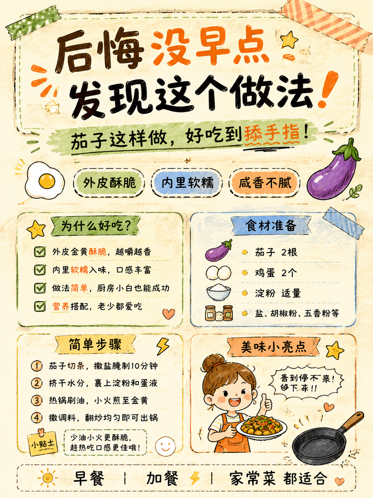
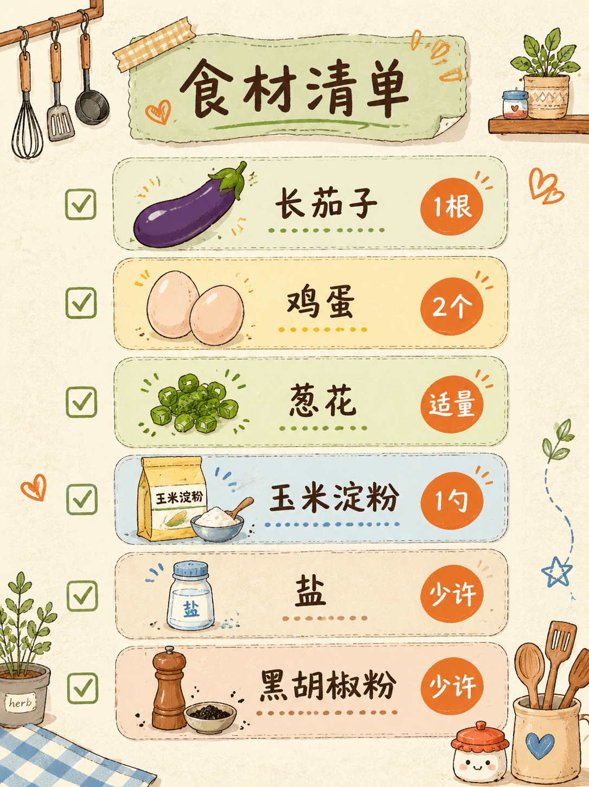
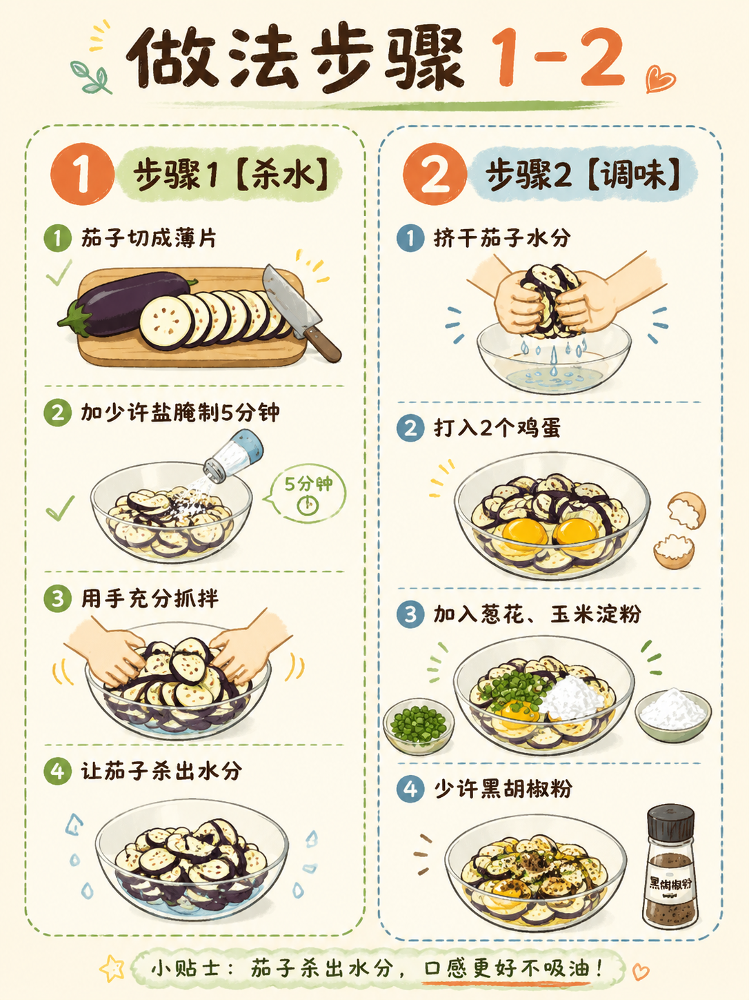
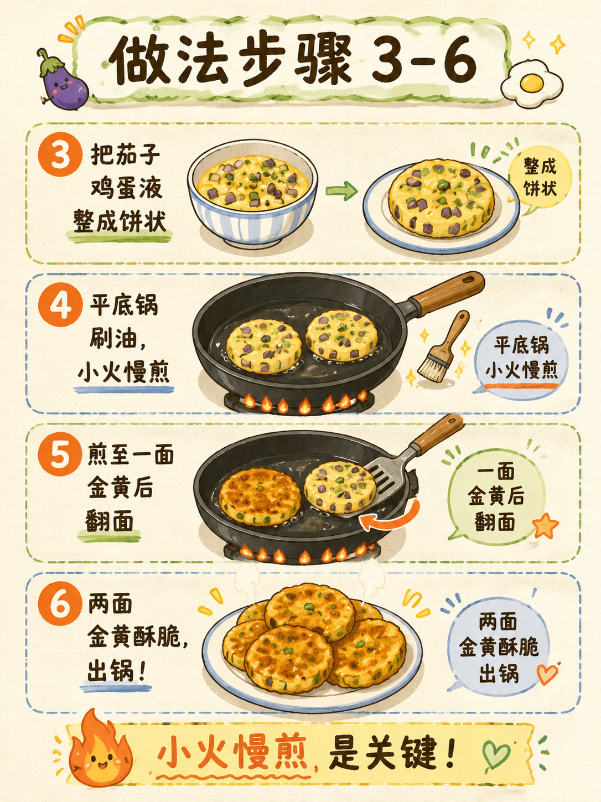
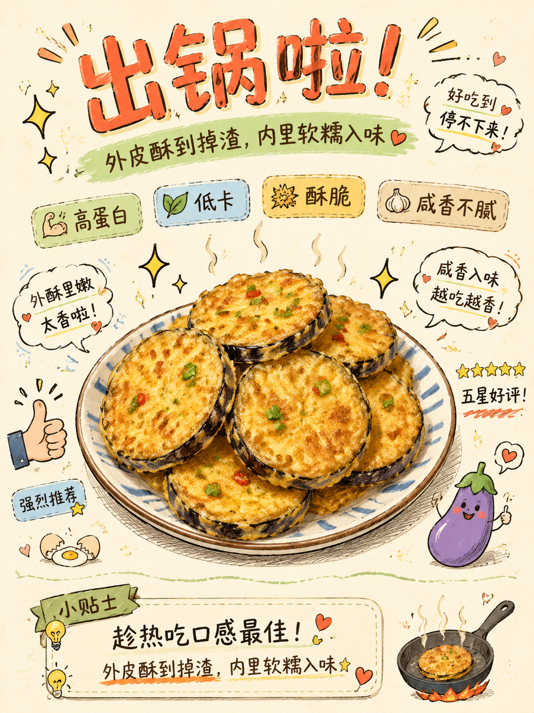

# 小绿书图文生成器

专为小红书、公众号等平台设计的 AI 图文生成工具。将你的选题或对标内容转化为精美的手绘信息图风格封面图。

**⚠️ 使用前请注意**
- 本 skill 使用 **GPT-Image-2** 模型生成图片
- GPT-Image-2 API 需要**自行解决**

**效果示例**（生成图片均为手绘信息图风格）：

| 封面图 | 内容图 | 步骤分解 |
|:---:|:---:|:---:|
|  |  |  |

| 步骤分解 | 成品展示 |
|:---:|:---:|
|  |  |
